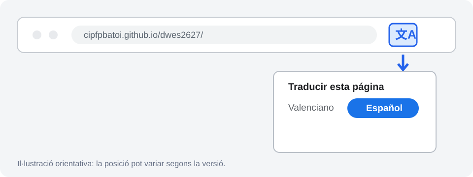
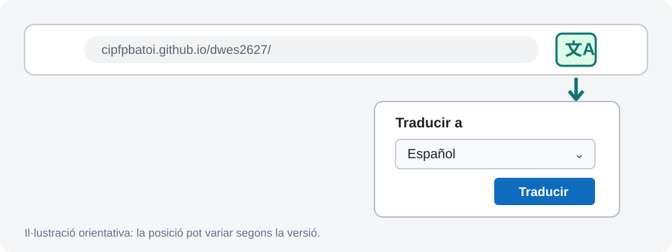
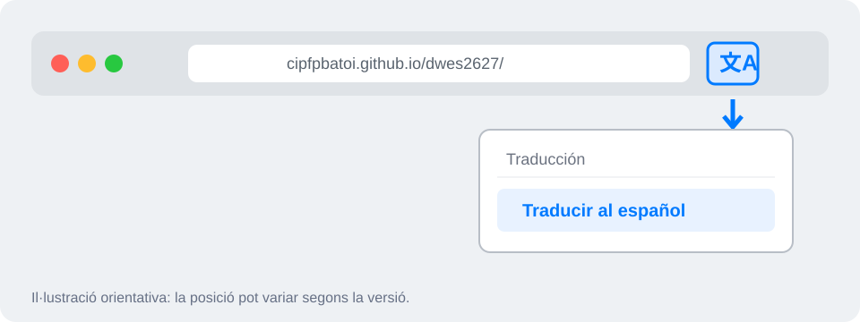

# 🌐 Com traduir la web al castellà

La web del curs està escrita en valencià, però pots usar la traducció automàtica del navegador per consultar-la en castellà. No has d’instal·lar cap extensió.

!!! tip "La manera més ràpida"
    En Chrome o Edge, fes **clic amb el botó dret** en qualsevol lloc de la pàgina i selecciona **«Traducir al español»**.

## Google Chrome

1. Obri la pàgina que vols consultar.
2. Prem la icona de traducció situada a la dreta de la barra d’adreces.
3. Tria **Español**. També pots fer clic amb el botó dret sobre la pàgina i seleccionar **«Traducir al español»**.

Si la icona no apareix, obri **Configuració → Idiomes** i comprova que està activada l’opció d’usar Google Translate. Consulta també l’[ajuda oficial de Chrome](https://support.google.com/chrome/answer/173424?hl=es).

## Microsoft Edge

1. Obri la pàgina que vols consultar.
2. Prem la icona de traducció situada a la dreta de la barra d’adreces.
3. En **Traducir a**, selecciona **Español** i prem **Traducir**.

També pots fer clic amb el botó dret sobre la pàgina i seleccionar **«Traducir al español»**. Consulta l’[ajuda oficial de Microsoft Edge](https://support.microsoft.com/edge/use-microsoft-translator-in-microsoft-edge-browser).

## Safari en Mac

1. Obri la pàgina que vols consultar.
2. Prem el botó de traducció del camp de cerca intel·ligent.
3. Selecciona **Traducir al español**.

Si **Español** no apareix, afegix-lo als idiomes preferits de macOS des de **Configuració del Sistema → General → Idioma i regió**. La disponibilitat pot variar segons la versió de macOS i la regió. Consulta l’[ajuda oficial d’Apple](https://support.apple.com/es-es/guide/safari/ibrw646b2ca2/mac).

## Important

- La traducció és automàtica i pot contindre algun error, especialment en vocabulari tècnic.
- Els noms de fitxers, ordres, codi i textos entre cometes s’han d’usar tal com apareixen en l’original.
- Els PDF de les presentacions no es traduïxen amb este procediment.
- Si una instrucció traduïda resulta confusa, consulta el text original o pregunta al professorat abans de continuar.
